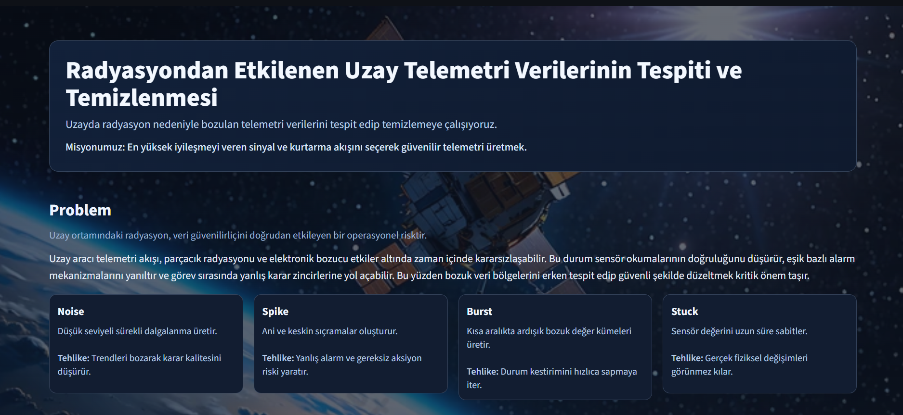
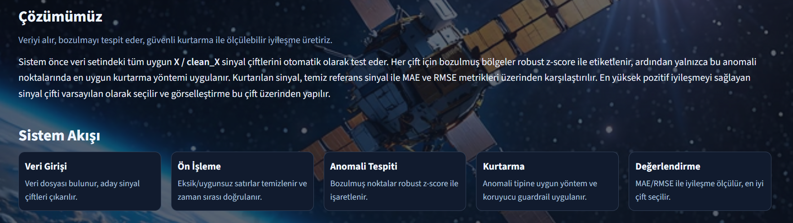
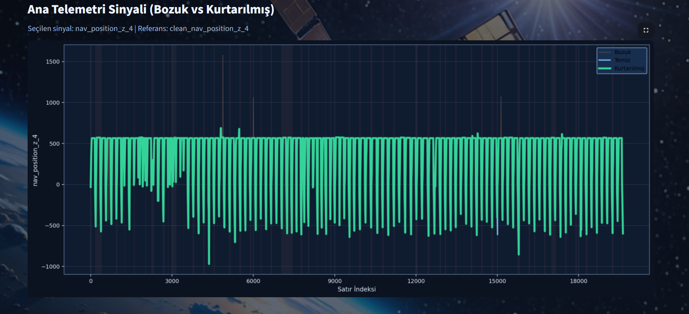
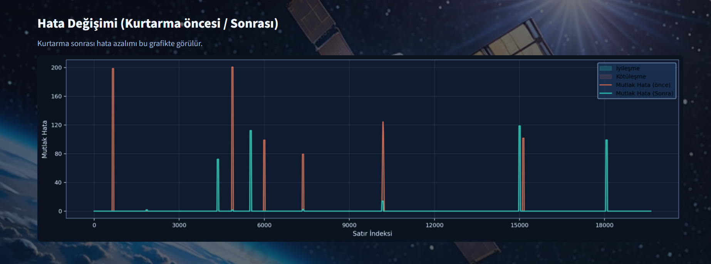
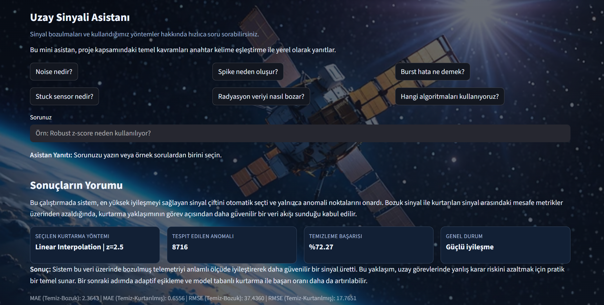

# Radyasyondan Etkilenen Uzay Telemetri Verilerinin Tespiti ve Temizlenmesi

Bu proje, uzay ortamında radyasyon kaynaklı bozulan telemetri sinyallerini tespit edip kurtarmak için geliştirilmiş bir Streamlit uygulamasıdır. Sistem, bozuk sinyal ile temiz referans sinyali karşılaştırarak farklı kurtarma stratejilerini dener, en iyi sonucu seçer ve iyileşmeyi görsel + metrik bazlı raporlar.

## 1) Projenin Amacı

Uzay telemetri verilerinde görülen tipik bozulmalar:
- `noise`: düşük amplitüdlü rastgele dalgalanmalar
- `spike`: ani ve yüksek genlikli tekil sıçramalar
- `burst`: ardışık bozuk örnek blokları
- `stuck`: sensörün uzun süre sabit değerde kalması

Amaç, bu bozulmaları dayanıklı şekilde işaretleyip yalnızca anomali bölgelerini düzelterek veriyi temiz referansa yaklaştırmaktır.

## 2) Öne Çıkan Özellikler

- Robust z-score (Median + MAD) ile anomali tespiti
- Birden çok kurtarma yöntemi:
  - Lineer interpolasyon
  - Rolling mean (lokal yumuşatma)
  - Anomali tipine duyarlı hibrit yöntem
- Guardrail (güvenlik katmanı): fiziksel olarak anlamsız düzeltmeleri geri alma
- MAE / RMSE ile önce-sonra kalite değerlendirmesi
- En iyi sinyal çifti + yöntem + eşik kombinasyonunun otomatik seçimi
- Streamlit dashboard üzerinde etkileşimli grafikler ve mini teknik asistan

## 3) Teknik Mimari (Uçtan Uca Akış)

1. Veri dosyası otomatik bulunur (`space_radiation_corrupted_dataset*`).
2. CSV/XLS/XLSX dosya okunur.
3. Zaman sütunu varsa tespit edilip doğrulanır.
4. `clean_X` / `X` sinyal çiftleri çıkarılır.
5. Her çift için anomali tespiti ve kurtarma kombinasyonları denenir.
6. MAE/RMSE karşılaştırılır, en iyi sonuç seçilir.
7. Dashboard’da sonuç grafik ve özet kartlarla sunulur.

## 4) Kullanılan Algoritmalar

### 4.1 Robust Z-Score

Klasik ortalama/std yerine medyan ve MAD kullanır.
Aykırı değerlere daha dayanıklıdır.

Formül (ölçekleme):
- `scale = 1.4826 * MAD`
- `z = |x - median| / scale`

### 4.2 Kurtarma Yöntemleri

- **Linear Interpolation**: Bozuk noktaları komşu güvenilir örnekler arasında doğrusal tahmin eder.
- **Rolling Mean**: Kısa pencere içinde yumuşatma yapar; özellikle noise için etkilidir.
- **Hibrit (Anomali Tipi)**:
  - noise -> hafif yumuşatma
  - spike -> lokal lineer geçiş
  - burst/stuck -> segment bazlı sınır komşuları ile rekonstrüksiyon

### 4.3 Recovery Guardrail

Kurtarılan değerler lokal komşuluk ve ölçek kontrolünden geçirilir.
İyileştirmeyen veya fiziksel sürekliliği bozan düzeltmeler geri alınır.

## 5) Değerlendirme Metrikleri

- **MAE (Mean Absolute Error)**: Ortalama mutlak hatayı ölçer.
- **RMSE (Root Mean Squared Error)**: Büyük hataları daha fazla cezalandırır.

Sistem, `mae_after` değerini minimize ederken genel iyileşme oranını da raporlar.

## 6) Performans Notu

Uygulamada ağır hesaplama adımları için cache kullanılır:
- veri okuma cache
- en iyi sinyal seçimi cache

Bu sayede dashboard içindeki her küçük etkileşimde tüm pipeline’ın baştan çalışması engellenir.

## 7) Proje Dizini

```text
project/
  app.py                 # Ana Streamlit uygulaması (dashboard + analiz + asistan)
  recovery.py            # Tip-duyarlı kurtarma yardımcıları
  requirements.txt       # Bağımlılıklar
  README.md              # Bu doküman
  data/
    dataset.csv
    HRSS_anomalous_optimized.csv
    results.csv
```

Not: `main.py`, `detect.py`, `recover.py`, `data_loader.py`, `corrupt.py` dosyaları şu an boş/yer tutucu durumdadır.

## 8) Veri Formatı Beklentisi

Uygulama aşağıdaki yapıyı bekler:
- Her hedef sinyal için bir bozuk sütun: `X`
- Aynı sinyalin temiz referansı: `clean_X`
- Opsiyonel zaman sütunu: `timestamp` / `datetime` / `date` / `time`
- Opsiyonel bozulma tipi sütunu: `corruption_type`

## 9) Kurulum

### 9.1 Gereksinimler

- Python 3.10+
- pip

### 9.2 Bağımlılık Kurulumu

```bash
pip install -r requirements.txt
```

## 10) Çalıştırma

`project` klasörü içinde:

```bash
python -m streamlit run app.py
```

Tarayıcıda Streamlit adresi açıldığında uygulama otomatik çalışır.

## 11) Dashboard’da Neler Görürsünüz?

- Problem ve çözüm özeti
- Sistem akış kartları
- Ana telemetri grafiği (bozuk / temiz / kurtarılmış)
- Hata karşılaştırma grafiği (önce-sonra)
- MAE/RMSE ve başarı kartları
- Anahtar kelime tabanlı mini teknik asistan

## 12) Sık Karşılaşılan Sorunlar

### 12.1 Uygulama yavaş
- Veri büyükse ilk çalıştırma süresi artabilir.
- İlk çalışmadan sonra cache devreye girer ve tekrarlar hızlanır.

### 12.2 Dosya bulunamıyor
- `space_radiation_corrupted_dataset*` desenine uyan dosyanın konumunu kontrol edin.

### 12.3 Türkçe karakterler bozuk görünüyor
- Dosyaların UTF-8 ile kaydedildiğinden emin olun.
- Terminal/IDE görüntüleme kodlamasını UTF-8 yapın.

## 13) Geliştirme Önerileri

- Adaptif eşik seçimi
- Model tabanlı (öğrenen) kurtarma yaklaşımları
- Gerçek zamanlı telemetri akışına entegrasyon
- Otomatik deney raporu (PDF/HTML) üretimi

## 14) Lisans ve Kullanım

Bu repo içinde açık lisans dosyası bulunmuyorsa, kullanım koşullarını proje sahibinizle netleştirmeniz önerilir.

---

Sorularınız için dashboard içindeki mini asistanı kullanabilir veya kod üzerinden doğrudan algoritma akışını inceleyebilirsiniz.





